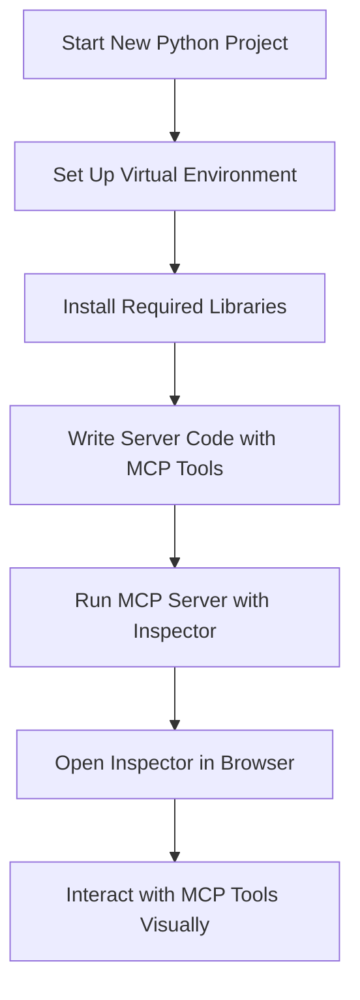

# MCP Server and MCP Inspector Setup on macOS

This guide walks through creating a Python environment using `uv`, setting up an MCP server with tools, and using MCP Inspector to test and invoke those tools. All steps are intended for a local development setup on macOS.

## Project Setup Overview




## 1. Initialize a New Python Project

Initialize a Python project using `uv`. This sets up a `pyproject.toml` and a `src/` directory:

```bash
uv init
````

## 2. Create a Virtual Environment with Python 3.13

First, locate the path to your Python 3.13 installation:

```bash
which python3.13
```

Use that path to create a new virtual environment:

```bash
uv venv --python /usr/local/bin/python3.13
```

This creates a `.venv` directory using Python 3.13.

Activate the virtual environment:

```bash
source .venv/bin/activate
```

Verify that the Python version is correct:

```bash
python --version
```

The output should confirm that you are using Python 3.13.

## 3. Install MCP and arXiv Client

Add project dependencies using `uv`:

```bash
uv add mcp arxiv
```

This installs the MCP runtime and the arXiv client library.

## 4. Run the MCP Server with MCP Inspector

Use `npx` to run MCP Inspector and launch the MCP server in one command:

```bash
npx @modelcontextprotocol/inspector uv run research_server.py
```

Explanation:

* `npx @modelcontextprotocol/inspector` launches the MCP Inspector UI in the browser and sets up proxying.
* `uv run research_server.py` runs your MCP server using the `uv` environment.

Once started, open the following URL in your browser:

```
http://127.0.0.1:6274/
```

This opens the Inspector UI, where you can browse, test, and invoke MCP tools defined in your server.

## 5. Example MCP Server Implementation

Create a file named `research_server.py` in your project root with the following code.

**Credit:**
This script is adapted from the [DeepLearning.AI course on MCP](https://learn.deeplearning.ai/courses/mcp-build-rich-context-ai-apps-with-anthropic), developed in collaboration with Anthropic.

```python
from mcp.server.fastmcp import FastMCP
import arxiv
import os
import json
from typing import List

mcp = FastMCP("research")
PAPER_DIR = "papers"

@mcp.tool()
def search_papers(topic: str, max_results: int = 5) -> List[str]:
    client = arxiv.Client()
    search = arxiv.Search(query=topic, max_results=max_results, sort_by=arxiv.SortCriterion.Relevance)
    papers = client.results(search)

    path = os.path.join(PAPER_DIR, topic.lower().replace(" ", "_"))
    os.makedirs(path, exist_ok=True)
    file_path = os.path.join(path, "papers_info.json")

    try:
        with open(file_path, "r") as f:
            papers_info = json.load(f)
    except (FileNotFoundError, json.JSONDecodeError):
        papers_info = {}

    paper_ids = []
    for paper in papers:
        paper_ids.append(paper.get_short_id())
        papers_info[paper.get_short_id()] = {
            'title': paper.title,
            'authors': [a.name for a in paper.authors],
            'summary': paper.summary,
            'pdf_url': paper.pdf_url,
            'published': str(paper.published.date())
        }

    with open(file_path, "w") as f:
        json.dump(papers_info, f, indent=2)

    return paper_ids

@mcp.tool()
def extract_info(paper_id: str) -> str:
    for item in os.listdir(PAPER_DIR):
        path = os.path.join(PAPER_DIR, item, "papers_info.json")
        if os.path.exists(path):
            with open(path, "r") as f:
                data = json.load(f)
                if paper_id in data:
                    return json.dumps(data[paper_id], indent=2)
    return f"No data found for paper {paper_id}."

if __name__ == "__main__":
    mcp.run()
```

## Notes

* MCP Inspector runs on port 6274 and proxies requests to the MCP server.
* The `.venv` created with `uv` is automatically recognized when activated.
* No `.python-version` file is required when using the virtual environment directly.